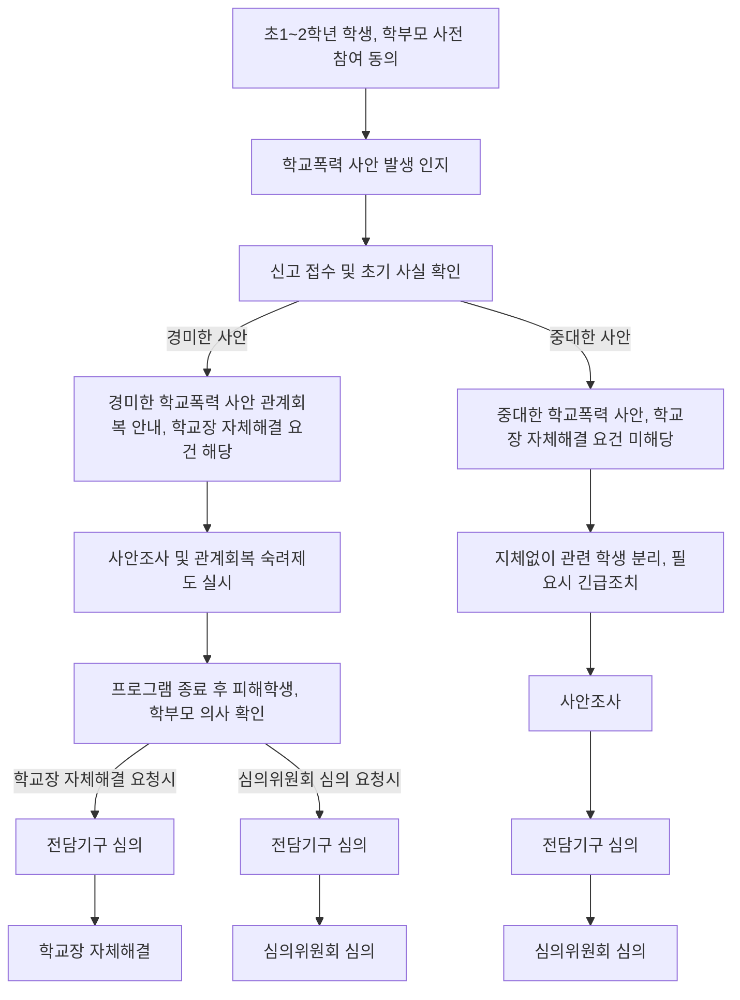

2023-24 학교폭력 뉴스
#### 1. 학교폭력 사안조사는 교사가 아닌 '학교폭력 전담 조사관'이 전적으로 담당한다.

조사관은 학교폭력, 생활지도 수사/조사 경력 등이 있는 퇴직 경찰 또는 퇴직 교원 등을 활용.
- 학교폭력 사안조사
- 전담기구 및 학교폭력 사례회의에서 사안조사 결과 보고
- 학교전담경찰관과 정보 공유, 사안 조사에 대한 의견 교류 역할 수행
신속한 대응을 위해 교육지원청에서 근무.

#### 2. 학교폭력 사례회의를 신설하여 조사관의 사안조사를 검토/보완한다.

2025-26 학교폭력 뉴스 
### 초등학교 저학년 관계회복 숙려제도

### 학교폭력 발생 특징
- 학교폭력 발생의 저 연령화 추세
- 물리적, 가시적 폭력에서 심리/정서적 폭력으로 확대
- 가시적 폭력의 감소, 비가시적 폭력의 증가
- 사이버 상에서의 따돌림 증가
- 학교 내 또래집단의 문화적 양태로 존재
- 학교폭력의 음성화-법 규범 적용의 어려움
- 피해자와 가해자의 구분이 모호
- 여학생의 학교폭력 증가

### 학교폭력 관련 정책 변화
- 스쿨폴리스 제도 도입
- 학교내 CCTV 설치 - 감시와 통제
- 촉법소년 연령 하향
- 피해자와 가해자 격리 강화
- 가해자에 대한 무제한 정학
- 교사에 대한 책무성 강화 - 처벌
- 학교생활기록부에 학교폭력 기록
- 학교폭력 전수조사 연 2회 실시
- 일진 형사처벌 강화

### 학교폭력 증가 실태
- 2014년부터 2016년까지 3년간 전국 초중고등학교(특수 학교 등 포함)에서 학교폭력 사안으로 심의한 건수는 총 19,521건에서 23,673건으로 약 21% 증가한 것으로 나타났다.
- 초등학교(2,792 -> 4,092 건으로 46.6% 증가)와 고등학교(5,266 -> 7,599건으로 43.3% 증가)에서 심의건수가 지속적으로 증가한 것으로 나타나 교육 당국의 적절한 대처가 요구된다.

### 학교폭력의 개념과 정의
- 학교 내외에서 학생을 대상으로 발생한 상해, 폭행, 감금, 협박, 약취, 유인, 명예훼손 모욕, 공갈. 강요, 강제적인 심부름 및 성폭력, 따돌림, 사이버 따돌림, 정보통신망을 이용한 음란, 폭력 등에 의하여 신체나 정신 또는 재산상의 피해를 수반하는 행위
- 학생의 신체,정신, 재산 피래를 수반하는 모든 행위를 포함한다.
- 따돌림 : 학교 내외에서 2명 이상의 학생들이 특정인이나 특정 집단의 학생들을 대상으로 지속적이거나 반복적으로 신체적 또는 심리적 공격을 가하여 상대방이 고통을 느끼도록 하는 일체의 행위
- 사이버 따돌림 : 인터넷, 휴대전화 등 정보통신기기를 이용하여 학생들이 특정 학생들을 대상으로 지속적, 반복적으로 심리적 공격을 가하거나 특정 학생과 관련된 개인정보 또는 허위사실을 유포하여 상대방이 고통을 느끼도록 하는 일체의 행위

### 학교폭력의 유형

#### 신체폭력
- 신체를 손, 발로 때리는 등 고통을 가하는 행위(상해, 폭행)
- 일정한 장소에서 쉽게 나오지 못하도록 하는 행위(감금)
- 강제(폭행, 협박)로 일정한 장소로 데리고 가는 행위(약취)
- 상대방을 속이거나 유혹해서 일정한 장소로 데리고 가는 행위(유인)
- 장난을 빙자한 꼬집기, 때리기, 힘껏 밀치기 등 상대 학생이 폭력으로 인식하는 행위

#### 언어폭력
- 여러 사람 앞에서 상대방의 명예를 훼손하는 구체적인 말(성격, 능력, 배경 등)을 하거나 그런 내용의 글을 인터넷, SNS 등으로 퍼뜨리는 행위(명예훼손), 내용이 진실이라고 하여도 범죄에 해당
- 여러 사람 앞에서 모욕적인 용어(생김새에 대한 놀림, 병신, 바보 등 상대방을 비하하는 내용)를 지속적으로 말하거나 그런 내용의 글을 인터넷, SNS 등으로 퍼뜨리는 행위(모욕)
- 신체 등에 해를 끼칠 듯한 언행("죽을래" 등)과 문자메세지 등으로 겁을 주는 행위(협박)

#### 따돌림
- 집단적으로 상대방을 의도적이고, 반복적으로 피하는 행위
- 싫어하는 말로 바보 취급 등 놀리기
- 빈정거림, 면박주기, 겁주는 행동, 골탕 먹이기, 비웃기
- 다른 학생들과 어울리지 못하도록 막는 행위

### 학교폭력의 유형-금품갈취와 강요
- 금품갈취
	- 돌려줄 생각이 없으면서 돈을 요구하는 행위
	- 옷, 문구류 등을 빌린다며 되돌려주지 않는 행위
	- 일부러 물품을 망가뜨리는 행위
	- 돈을 걷어오라고 하는 행위
- 강요
	- 속칭 빵셔틀, 와이파이 셔틀, 과제 대행, 게임 대행, 심부름 강요 등 의사에 반하는 행동을 강요하는 행위(강제적 심부름)
	- 폭행 또는 협박으로 상대방의 권리 행사를 방해하거나 해야 할 의무가 없는 일을 하게 하는 행위(강요)

#### 성폭력
- 폭행, 협박을 하여 성행위를 강제하거나 유사 성행위, 성기에 이물질을 삽입하는 등의 행위
- 상대방에게 폭행과 협박을 하면서 성적 모멸감을 느끼도록 신체적 접촉을 하는 행위
- 성적인 말과 행동을 함으로써 상대방이 성적 굴욕감, 수치감을 느끼도록 하는 행위

#### 사이버 폭력
- 속칭 사이버모욕, 사이버명예훼손, 사이버성희롱, 사이버스토킹, 사이버음란물 유통, 대화명 테러
- 인증놀이, 게임부주 강요 등 정보통신기기를 이용하여 괴롭히는 행위
- 특정인에 대해 모욕적 언사나 욕설 등을 인터넷 게시판, 채팅, 카페 등에 올리는 행위-특정인에 대한 저격글이 그 한 형태
- 특정인에 대한 허위 글이나 개인 사생활에 관한 사실을 인터넷, SNS 등을 통해 불특정 다수에 공개하는 행위
- 성적 수치심을 주거나 위협하는 내용, 조롱하는 글, 그림 , 동영상 등을 정보통신망을 통해 유포하는 행위
- 공포심이나 불안감을 유발하는 문자, 음향, 영상 등을 휴대폰 등 정보통신망을 통해 반복적으로 보내는 행위
- 정보통신망을 이용하여 딥페이크 영상을 제작, 배포하는 행위

### 학교폭력 개념규정의 한계
1. 학교폭력 행위에 대한 광범위한 규정 : 갈등 속에서 발생할 수 있는 대부분의 행동이 학교폭력으로 규정 가능
2. 학교폭력 사안의 복잡한 특성을 반영하지 못하는 한계 : 사건을 둘러싼 다양한 당사자와 복잡한 맥락이 반영되지 못함
3. 구체적이고 명료한 세부 기준의 부재 : 사건을 명확한 기준 없이 일괄적으로 적용해 사안에 부합하는 해결이 어려움
4. 학교폭력 행위 중심의 적용 문제 : 행위를 중심으로 사안처리에 따른 사각지대가 존재
5. 학교와 학생을 중심으로 학교폭력을 규정 : 탈학교 청소년, 대안학교 학생의 경우 학교폭력 대책법의 적용대상이 되지 못함.

### 갈등으로서의 학교폭력
현재의 학교폭력은 갈등의 파괴적 해결로서 폭력이 발생
그 이면의 갈등의 문제는 외면하고 이를 폭력에 의한 범죄행위로만 이해
처벌중심의 법적 해결에 집중

- 예방 교육을 통해 문제해결 능력의 확대
- 갈등의 비폭력적 해결을 위한 노력 필요
- 교육적 과정을 통한 개입의 기회 확보
- 피해자의 피해회복과 가해자의 사회적 통합 실현
- 사법적 사안처리에서 처리 이후 과정에 대한 고려 필요

### 학교폭력의 이해
#### 생물학적 이론
학교폭력과 같은 공격 성향은 유전되거나 뇌손상과 같은 생물학적 요인이 학교폭력의 주된 원인이 된다는 관점
- 신경생물학적 요인 : 편도체와 전두엽의 작용, 본능적 반응으로서 폭력 행위 - 반사회적 성격장애, 품행장애 아동과 청소년 전두엽 기능 이상과 상관이 있음. 
- 신경생물학적 결함 : 뇌 기능상 결함이 자기 조절을 어렵게 하여 공격행동 및 비행 등의 품행상의 문제를 일으킨다. - 폭력적 아동의 상당수는 미세한 신경학적 이상을 보이며 심한 폭력행동을 보이는 상당수의 아동에게서 뇌파, 뇌 기능에 대한 신경학적 이상이 나타남.
-> 폭력성향이란 인간이 유전적으로 갖고 태어나는 것으로 가정하고 폭력적인 사람들은 유전적으로 폭력성향을 통제해야 하는 뇌 신경체계의 장애로 인해 공격행위를 보인다는 관점

#### 추동이론(정신분석학적 접근)
인간 내면에 삶을 보존하고 번성하게 하는 에너지인 리비도 외에 삶을 파괴하고 태어나기 전의 평형 상태로 돌아가려는 죽음의 추동 '타나토스'의 존재가 있는데 이 리비도와 타나토스라는 두 추동이 늘 긴장 속에서 상호작용하며 인간의 모든 행동을 결정한다는 이론

- 추동이론은 공격성을 자연스러운 본능으로 인정
- 죽음의 본능은 지속적으로 충족 필요
- 죽음의 본능을 발산하지 못하면 어느 순간 터져나와 정신장애를 유발시킬 수 있음
- 죽음의 에너지는 타인을 향해 발현
- 공격적인 행동을 발산할 수 있음.

따라서 이러한 본능을 가능한 순화된 형태로 승화할 필요가 있으며 가장 일반적인 형태로는 스포츠 경기에 참여(운동) 하거나 관람하는 것, 영화를 보는 것등을 통해 정화해야 한다.

#### 정신분석 이론
인간에게는 모두 폭력적 충동이나 본능이 있다고 가정하고 자아와 초자아와 같은 내부 심리기제의 작용과 관련하여 학교폭력 등의 유발행위를 설명
- 현실적 객관적 정신기능을 하는 자아가 건강하게 발달하지 못할 때 공격행동과 같은 폭력이 발생 / 현실세계에서 자기 자신에 대한 자기정체성이 확립하지 못하면 정체성의 혼란을 가지고 오고 이는 내적 위기를 동반하여 공격성, 반사회적 행동을 수행

폭력 충동이란 행위자 내부에서 지속적으로 생성되고, 자아나 초자아의 통제가 결핍되거나 부모와의 애착관계가 형성되지 못하면 비합리적 폭력으로 표출되며 열등감을 보상하기 위한 행위로 폭력행위가 유발되기도 한다.

#### 사회학습 이론
사회적 행동이 그 행동의 보상이나 처벌에 의해 학습된다는 이론-아동의 폭력 행동을 강화와 관찰, 혹은 모방을 통해 학습된 결과라고 보는 입장으로 직접적이건 간접적잉건 폭력행위는 학습의 결과로 보는 관점

- 고전적 조건형성과 조작적 조건형성을 통해 폭력도 학습이 가능
- 규범, 가치관, 신념, 태도 등은 교사, 부모, 친구로부터 조건형성을 통해 학습

부모가 폭력 행위에 대해서 호의적으로 말한다거나, 주위 사람들이 아동에게 폭력 행위를 부추기는 경우, 폭력 행위에 대한 보상이 주어지는 경우 그런 행동의 가능성은 상승한다.

사회인지이론(Social Cognitive Theory)
폭력 행위는 강화, 관찰학습(행동이나 언어모방)과 모델링을 통해 (학습, 텔레비전, 교사와 학부모의 행동, 폭력적 영상물 등) 학습될 수 있다는 것.

차별접촉이론
친밀한 친구와의 차별적 접촉을 통해 학교폭력과 같은 폭력행동의 학습, 집단에서 벗어나지 않는 한 폭력행위는 지속

일상적으로 접하는 사람과의 상호작용을 통해 폭력이나 범죄에 대한 허용적 가치와 태도를 학습할 수 있다.

#### 사회유대이론(사회통제 관점)
비행은 사회에 대한 개인의 유대가 약하거나 깨졌을 때 일어난다는 일반명제를 전제로 한다. 사람들이 살아가면서 전통적인 조직 및 집단의 사회적 관계 속에 있으면서 나쁜 행동은 덜하고 적절한 품행 규범을 더욱 내면화한다고 가정하는 것이다.
- 타인에 대한 애착-우리가 타인에 대해서 갖는 긴밀한 애정의 관계, 그들에 대한 존경, 그들과 동일시하는 정도로 이것이 강할수록 타인의 기대에 어긋나지 않으려고 노력
- 사회유대에 따른 통제와 관련해 주요 개념으로 애착뿐 아니라 교육적 열망 등으로 나타날 수 있는 관여, 친구 등과의 통상적 활동으로 참여, 사회 가치체계에 대한 신념등 네 가지가 영향을 미친다.

아동이 가정, 학교, 사회와 유대가 없고 그 통제력이 약화되어 아동에게 어떤 영향도 미치지 못하며 아동도 부모나 교사 등 의미있는 사람들에 대해 아무 관심이 없으면 아동의 학교폭력과 같은 폭력 행위는 더욱 자유롭게 일어날 수 있다는 것이다.

#### 사회통제 이론
사회통제라는 사회학적인 개념은 개인이 사회화를 통해 자기통제를 습득하는 것과 순응은 보상하고 일탈은 처벌하는 사회적 제대를 통해서 사람의 행동을 통제하는 것 모두를 포함하는 개념이다.

사회통제이론은 사람들이 범죄를 저지르지 않고 잘못을 하지 않는 것은 사회가 이를 통제하고 사람들은 순응하고 있기 때문이라는 것을 전제로 순응을 설명하는 이론이다.
- 왜 잘못과 범죄를 저지르는가가 아니라 우리는 왜 법을 위반하지 않는가에 관심을 둔다.
- 긍정적 유대관계는 불량행위를 줄이고 부정적 유대관계는 위험을 높일 수 있다는 입장
- 폭력행동의 원인을 개인 밖의 사회적 환경과 상황에 귀인시키고 상황적 조건과 함께 고려하여 분석

#### 긴장이론적 관점
긴장이론은 목표에 대한 좌절이 개인적 범죄로 나가는 원인이 된다는 이론, 학교생활에서 학생들은 부모가 갖는 기대와 자기 능력의 격차, 성적과 시험으로 인해 많은 압력과 긴장에 시달리고 있으며 이러한 학생들이 겪는 긴장이 반사회적 행동을 강화하는 원인이 된다는 이론

Cohen의 긴장이론
- 학교는 다양한 계층이 사회적 지위를 얻기 위해 경쟁하는 공간
- 하류계층은 상대적으로 불리한 위치에 있으며 경쟁을 하지만 좌절
- 이러한 좌절을 극복하기 위해 일탈을 하거나 비행 하위문화에 참여

"부모의 지나친 학업에 대한 기애돠 압력으로 긴장을 갖고 있는 학생들 혹은 사회구조적으로 불리한 위치에 있어 좌절과 긴장을 겪는 하류계층 출신의 학생들이 이러한 긴장을 극복하기 위하여 학교폭력을 비롯한 일탈행동을 수행한다."

#### 모멸극복 관점
자기보다 신체적, 정신적으로 취약한 학생에게 폭력을 가함으로써 자기보다 강한 사람으로부터의 모멸감을 극복하기 위해 폭력행동을 취한다는 입장

- 폭력과 비행의 동기는 외부에 있는 것이 아니며 행위자가 내면에서 겪는 모멸감이 폭력의 주요 원인으로 보는 입장
- 자신의 가치가 무시되거나 인정받지 못했을 때 모멸감을 느끼고 훼손된 자기 가치를 복원하려는 동기에서 분노심이나 폭력행위에 의존
- 가해자는 그렇기에 폭력행위 이후에도 피해자를 평가절하함으로써 자기의 모멸된 가치를 절하할 뿐 아니라 폭력행위를 정당화

인간은 좌절에 의해 야기된 내적 충동을 해소하도록 동기화되어 있으며 공격 행위는 그것을 해소하기 위해 나타나는 것이다.

#### 생태학적 이론
학생들이 경험하는 학교폭력의 피해가 개인적 특성, 학교와 지역사회의 특성, 학생들의 가정적 배경, 학생들의 문화적 맥락과 같은 보다 넒은 의미의 사회적 맥락의 상호작용에 의해 영향을 받는다는 것을 강조
- 미시체계, 중간체계, 외체계, 거시체계가 존재
- 아동들과 청소년들의 사회적 발달은 사회 체계와의 상호 작용 속에서 발달
- 학교폭력은 고립되어 일어나지 않으며 개인과 그의 가족, 또래집단, 학교, 지역사회 및 사회적 규범 간의 복합적인 상호작용의 결과

학교폭력은 여러 하위 체계, 개인, 가정, 학교, 사회 관련 요인들의 상호작용의 산물이다.

### 학교폭력에 영향을 주는 요인
#### 개인요인
1. 연령에 따른 차이
2. 성별에 따른 차이
3. 개인의 심리적, 인지적, 심리학적 차이
4. 개인의 스트레스 경험

성별, 신장과 신체적 특징, 공격성과 충동성, 불안 및 우울, 자존감, 인지능력, 대인문제 해결 능력, 신체적, 정신적 장애, 타인에 대한 공감능력 부족

#### 가정요인
가정의 사회경제적 지위와 같은 구조적 특성과 부모의 양육방식 같은 기능적 특성으로 구분해서 접근
1. 가정의 사회경제적 수준
2. 부모의 자녀 양육 방식
	- 권위주의적, 가부장적 가정환경
	- 온정적이지 못한 태도, 체벌교육, 폭력사용

3. 감독과 점검의 부재
	- 자녀교육에 있어 부모의 참여 부재
	- 생활 감독의 부족
4. 가족간의 유대 관계-자녀와 부모의 애착 등

#### 지역사회 요인
지역 사회의 문화적, 환경적 여건은 학교폭력을 유발하는 위험 요인으로 작용한다.
1. 대중매체
2. 학교 및 지역사회의 유해환경
3. 폭력에 대한 방관과 묵인 문화
4. 지나친 경쟁 위주 사회적 풍토
5. 여가 활동의 기회나 시설 부족

#### 학교요인
1. 교사와 학교 당국의 폭력에 대한 인식과 반응
2. 교사, 교장의 태도나 행동-리더십의 문제
3. 학교폭력에 대한 또래집단의 반응
4. 학교의 풍토
5. 또래 집단의 문화
6. 폭력에 대한 학교의 정책 결정에서 학생 참여
7. 학생들에 대한 교사의 지원
8. 학교의 규모와 학생의 수