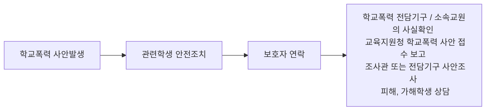
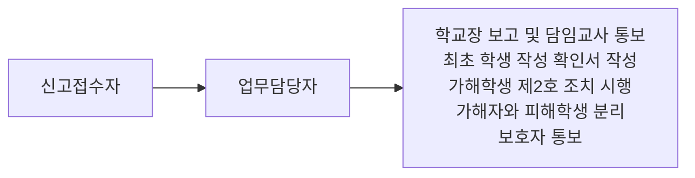

#### 학교폭력 관련 법률
- 형법
- 소년법
- 학교폭력 예방 및 대책에 관한 법률
- 성폭력 범죄의 처벌 등에 관한 특례법
- 정보통신망 이용촉진 및 정보보호 등에 관한 법률
- 초중등교육법
- 청소년보호법

#### 학교폭력 예방 및 대책에 관한 법률
- 전담기구 및 자치위원회
- 학교폭력 예방교육
- 피해학생 보호
- 가해학생 선도
- 분쟁조정위원회
- 학교폭력 사안처리 과정
- 학교폭력 지원체계

##### 주요 조항
- 제12조 학교폭력대책자치위원회의 설치 및 기능
- 제13조 자치위원회 구성 및 운영
- 제14조 전문상담교사 배치 및 전담기구 구성
- 제15조 학교폭력 예방 교육
- 제16조 피해학생의 보호
- 제17조 가해학생에 대한 조치
- 제18조 분쟁조정
- 제20조 학교폭력 신고의무
- 제20조의 5 학생보호인력의 배치 등
- 제21조 비밀누설금지 등

### 2019년 학교폭력법 개정안 발표
#### 주요내용
- 학교폭력대책자치위원회를 폐지하고 **교육지원청에 학교폭력대책심의위원회**를 두도록 함
- 학교폭력대책심의위원회는 10명 이상 50명 이내의 위원으로 구성하되 **전체 위원의 3분의 1 이상을 해당 교육지원청 관할 구역 내 학교에 소속된 학생의 학부모로 위촉**하도록 함
- 학교의 장은 학교폭력 사태를 인지한 경우 지체 없이 전담기구 또는 소속 교원으로 하여금 가해 및 피해사실 여부를 확인하도록 하고 **전담기구로 하여금 학교의 장의 자체해결 부의 여부를 심의하도록 함**
- 학교폭력 조치에 이의가 있는 피해학생 및 **가해학생은 '행정심판법'에 따른 행정심판을 청구**할 수 있도록 함.

#### 개정이유
- 학교폭력대책자치위원회 **심의 건수 증가로 담당 교원 및 학교의 업무 부담이 증가**, 자치위원회 전체 위원의 과반수를 학부모 대표로 위촉하도록 되어 있어 **학교폭력 사안 처리에 전문성이 부족** 하다는 의견 제기
- 경미한 수준 학교폭력 사안인 경우에도 학교폭력대책자치위원회 심의대상이 되어 담당 교원 및 학교장의 적절한 생활지도를 통한 해결이 곤란한 상황임
- **학교폭력대책자치위원회->학교폭력대책심의위원회로 교육지원청으로 상향 이관** 하고 **피해학생과 가해학생에 대한 재심기구를 행정심판위원회로 일원화**

### 학교폭력 사안처리 절차

1. (학교)전담기구 사안 접수 : 신고접수대장 기록
2. 가해학생과 피해학생의 분리 : 제2호(접촉, 협박, 보복행위 금지) 조치 시행
3. (학교)전담기구 사실 확인
	- 최초 확인서 접수
	- 사안접수 보고서 제출(교육지원청 제로센터 : 전담조사관 배정)
교사의 신고의무
- 아동, 청소년 대상의 성범죄 발생 사실을 알게 된 경우 [아동, 청소년의 성보호에 관한 법률]제34조에 따라 수사기관에 즉시 신고해야 함
- 직무를 수행하면서 아동학대 범죄를 알게 된 경우나 그 의심이 있는 경우에는 [아동학대범죄의 처벌 등에 관한 특례법] 제10조에 따라 시,도, 시군구 또는 수사기관에 즉시 신고해야함

4. (교육지원청) 전담조사관, 사안조사 - 확인서 접수
	- 피해 및 가해사실 조사
		- 추가 학생 확인서
		- (필요시) 목격자 면담
	- (필요시) 관련학생 보호자 면담
	- 사안조사 결과보고서 작성
	- 조사결과 보고 : 학교(전담기구), 교육지원청(제로센터)

5. (학교) 학교장 긴급조치
6. (학교) 전담기구, 학교장 자체해결 부의 여부 심의
	- 자체해결 시, 학교장 자체해결 결과보고
	- 자체해결 불가 시, 심의위원회 개최 요청

7. (교육지원청) 제로센터, 사례회의 개최
	- 보완조사 필요시, 전담조사관 추가 조사
	- 보안조사 불필요시, 심의위원회 개최
8. (교육지원청) 심의위원회 개최
	- 심의위원회 참석 안내(학부모), 개최알림 공문(학교)
9. (교육지원청) 심의위원회 심의, 의결
10. (교육지원청) 교육장 조치결정 통보 : 조치결정 통보서(학부모), 조치결정 통보 공문(학교)

11. (학교) 가해학생 조치사항 학교생활기록부에 기재
12. (학교) 피가해학생 조치 이행
	- 피해학생 보호조치
	- 가해학생 선도조치
	- 가해학생 및 보호자 특별교육

#### 12조 학교폭력대책자치위원회 설치 및 기능
1. 학교폭력 예방 및 대책수립을 위한 학교체제 구축
2. 피해학생 보호
3. 가해학생에 대한 선도 및 징계 -> 가해학생에 대한 **교육**, 선도 및 징계
4. 피해학생과 가해학생간의 분쟁조정
5. 그 밖에 대통령령으로 정하는 사항

### 13조-심의위원회 구성 및 운영
1. 심의위원회 재적위원 4분의 1이상이 요청하는 경우
2. 학교의 장이 요청하는 경우
3. 피해학생 또는 그 보호자가 요청하는 경우
4. 학교폭력이 발생한 사실을 신고받거나 보고받은 경우
5. 가해학생이 협박 또는 보복한 사실을 신고받거나 보고받은 경우
6. 그 밖에 위원장이 필요하다고 인정하는 경우

#### 신설조항(제13조의2, 학교의 장의 자체해결)
피해학생 및 그 보호자가 심의위원회 개최를 원하지 아니하는 다음 각 호에 모두 해당하는 경미한 학교폭력의 경우 학교의 장은 학교폭력 사건을 자체적으로 해결할 수 있다. 이 경우 학교의 장은 지체 없이 이를 심의위원회에 보고하여야 한다.
- 2주 이상 신체적, 정신적 치료를 요하는 진단서를 발급받지 않은 경우
- 재산상 피해가 없거나 즉각 복구된 경우
- 학교폭력이 지속적이지 않은 경우
- 학교폭력에 대한 신고, 진술, 자료제공 등에 대한 보복행위가 아닌 경우

학교의 장은 제1항에 따라 사건을 해결하려는 경우 다음 각 호에 해당하는 절차를 모두 거쳐야 한다.
1. 피해학생과 그 보호자의 심의위원회 개최 요구 의사의 서면 확인
2. 학교폭력의 경중에 대한 제14조 제 3항에 따른 전담기구의 서면 확인 및 심의
그 밖의 학교의 장이 학교폭력을 자체적으로 해결하는 데에 필요한 사항은 대통령령으로 정한다.

#### 14조-전문상담교사 배치 및 전담기구 구성
- 전문상담교사는 학교의 장 및 자치위원회의 요구가 있는 때에는 학교폭력에 관련된 피해학생 및 가해학생과의 상담결과를 보고하여야 한다.
- 학교의 장은 교감, 전문상담교사, 보건교사 및 책임교사(학교폭력 문제를 담당하는 교사를 말한다.) 등으로 학교폭력 문제를 담당하는 전담기구를 구성하며 학교폭력 사태를 인지한 경우 지체없이 전담 기구 또는 소속 교원으로 하여금 가해 및 피해 사실 여부를 확인하도록 한다.

#### 15조-학교폭력 예방 교육
1. 학교의 장은 학생의 육체적 정신적 보호와 학교폭력의 예방을 위한 학생들에 대한 교육(학교폭력의 개념, 실태 및 대처방안 등을 포함)을 학기별로 1회 이상 실시해야 한다.
2. 학교의 장은 학교폭력 예방 및 대책 등을 위한 교직원 및 학부모에 대한 교육을 학기별로 1회 이상 실시하여야 한다.
3. 학교의 장은 제1항에 따른 학교폭력 예방교육 프로그램의 구성 및 그 운용 등을 전담기구와 협의하여 전문단체 또는 전문가에게 위탁할 수 있다.

#### 16조-피해학생의 보호
1. 심리상담 및 조언
2. 일시보호
3. 치료 및 치료를 위한 요양
4. 학급교체

#### 17조-가해학생에 대한 조치
1. 피해학생에 대한 서면사과
2. 피해학생 및 신고,고발 학생에 대한 접촉, 협박 및 보복행위의 금지
3. 학교에서의 봉사
4. 사회봉사
5. 학내외 전문가에 의한 특별 교육이수 또는 심리치료
6. 출석정지
7. 학급교체
8. 전학
9. 퇴학처분

#### 17조의 2 재심청구
1. 학교의 장이 제16조제1항 및 제17조제1항에 따라 내린 조치에 대하여 이의가 있는 피해학생 및 보호자는 그 조치를 받은 날부터 15일 이내 또는 그 조치가 있음을 알게 된 날부터 10일 이내에 지역위원회에 재심 청구 할수 있다. 
2. 학교의 장이 제17조제1항제8호와 제9호에 따라 내린 조치에 대하여 이의가 있는 학생 및 보호자는 그 조치를 받은 날부터 15일 이내 또는 그 조치가 있음을 알게 된 날부터 10일 이내에 [초중등교육법] 제18조의3에 따른 시도학생 징계 조정위원회에 재심을 청구할 수 있다.

#### 18조-분쟁조정
1. 자치위원회는 학교폭력과 관련해 분쟁이 있는 경우 그 분쟁을 조정할 수 있다.
2. 제1항에 따른 분쟁 조정기간은 1개월을 넘지 못한다.
3. 학교폭력과 관련한 분쟁조정에는 다음 각호의 사항을 포함한다.
	1. 피해학생과 가해학생 간 또는 그 보호자 간의 손해배상에 관련된 합의조정
	2. 그 밖에 자치위원회가 필요하다고 인정하는 사항

학교폭력예방법 시행령 25조 분쟁조정의 신청
학교폭력예방법 27조 분쟁조정의 개시
학교폭력예방법 28조 분쟁조정의 거부, 중지 및 종료

#### 학교폭력 대응 방법
학교폭력 발생 시 대응 순서

신고 및 접수 절차

담임교사 또는 교직원
- 보호자 연락 : 피해학생 상태 및 병원 안내
- 병원 이송 시 동승
- 사안조사에 협조

학교폭력 전담기구
- 교감 : 상황파악, 지시
- 책임교사 : 상황 지시, 주위 학생 안정 및 질서 유지 지도, 진행상황 육하원칙에 따라 기록
- 보건교사 : 응급조치, 병원 이송 시 동승, 차량 내에서 요원의 응급처치 도움, 병원에서 피해학생 상태 설명
- 전문상담교사 : 피해학생의 심리적 안정 지원 또는 가해학생 대상 초기 상담

학교장 등 관리자
- 전반적인 상황 파악 및 총괄
- 원인 분석 및 재발 방지 주력

#### 학교폭력 전담기구 역할
1. 사안접수 및 보호자 통보
2. 학교폭력 사실 확인 및 사안조사
3. 교육(지원)청 보고
4. 학교장 자체해결 부의 여부 심의
5. 학교장 긴급조치 여부 심의
6. 집행정지 결정에 따른 가해학생과 피해학생 분리 심의
7. 졸업 전 가해학생 조치사항 삭제 심의
8. 집중 보호 또는 관찰대상 학생에 대한 생활지도
9. 학교폭력 실태 조사

#### 학교폭력 조사관 역할
조사관의 요건
- 교원으로 재직했던 사람으로서 학교폭력 또는 생활지도 업무 경력이 2년이상
- 경찰로 재직했던 사람으로서 학교폭력, 선도 업무 또는 조사, 수사 업무 경력이 2년 이상
- 청소년 선도, 보호 및 상담 단체에서 청소년 선도, 보호 및 상담 활동을 2년 이상
- 그 밖에 학교폭력 예방 및 청소년 보호에 대한 지식과 경험이 풍부하다고 교육장이 인정하는 사람

조사관의 역할
- 학교폭력 사안 조사
- 관계회복 프로그램 안내
- 사안조사 보고서 작성 및 조사 결과 보고
- 사례회의 참석
- 학교전담경찰관과 정보 공유 및 조사에 대한 학교전담경찰관에 자문 요청
- 그 밖에 교육감 또는 교육장이 정하는 사항

#### 학교의 역할
- 학교장 자체해결 및 **피가해 학생 간 관계개선 및 회복**
- **피가해 학생 분리 실시**, 필요시 **피해학생 긴급보호조치** 또는 **가해학생 긴급조치**
- **피해학생 면담**을 통해 피해학생의 **어려움과 필요한 도움**을 파악하여 **즉각적이고 안전한 보호 방안** 마련
- 교육(지원)청에 사안접수 보고 시, 관련학생의 조사가 가능한 시간과 장소 등을 기입
- 조사관의 사안 조사 시 책임교사 등 학교 관계자는 조사관의 사안조사 준비 지원
- 조사관의 사안 조사시, 교원의 협력 방법은 관련 학생의 심리적 상태, 나이, 성별, 사안의 성격 및 조사관의 요청 등을 고려하여 학교장이 판단
- 조사관이 학부모 면담 요청 시, 장소 제공
- 조사관이 관련 교사 등에게 출석, 진술, 조사협조 및 자료제출 요청시 협조
- 조사관이 접수한 학생 확인서 원본 및 증빙자료 관리 및 조사관에게 사본 및 스캔본 제공

#### 학교폭력 아닌 사안 종결 처리
1. 사안조사 결과 학교폭력이 아닌 사안
	- 제3자가 신고한 사안에 대한 조사결과, 학교폭력이 아니었던 경우(오인신고)
	- 학교폭력 의심사안(담임교사 관찰로 인한 학교폭력 징후 발견 등)에 대한 조사 결과, 학교폭력이 아니었던 경우
	- 피해학생(보호자)이 신고한 사안에서 피해학생(보호자)이 오인신고였음을 스스로 인정하고 조사결과 학교폭력이 아니었던 경우
2. 학교폭력이 아닌 사안의 처리
	- 학교장은 초기 사실확인이나 조사결과를 통보받은 후 전담기구 회의를 통해 학교폭력이 아님을 확인한 경우 교육(지원)청으로 보고한다.
	- 다만 피해학생 및 보호자가 심의위원회 개최를 요청할 경우 반드시 심의위원회를 개최하여 처리해야 함. 심의위원회에서 '학교폭력 아님'으로 결정할 경우 '조치없음'으로 처리 가능.
3. 가해자가 학생이 아닌 사안의 처리
	- 가해자가 학생이 아닌 경우, 학교장 자체해결 대상 사안이 아니며 학교장은 피해학생의 보호를 위해 심의위원회 개최를 요청해야 함. 다만 피해학생과 그 보호자가 피해학생 보호 조치를 원하지 않을 경우 학교장은 심의위원회 개최를 요청하지 않을 수 있음.

#### 학교폭력 행위의 경중 판단 여부
- 피해학생이 장애학생인지 여부
- 피해학생이나 신고, 고발 학생에 대한 협박 또는 보복행위인지 여부
- 가해학생이 행사한 학교폭력의 심각성, 지속성, 고의성
- 가해학생의 반성의 정도
- 해당 조치로 인한 가해학생의 선도 가능성
- 가해학생 및 보호자와 피해학생 및 보호자 간의 화해 정도
- 교사 행위를 했는지 여부
- 2인 이상의 집단 폭력을 행사한 것인지 여부
- 위험한 물건을 사용했는지 여부
- 폭력행위를 주도했는지 여부
- 폭력서클에 속해 있는지 여부
- 정신적, 신체적으로 심각한 장애를 유발했는지 여부

#### 학교폭력 사안처리와 사법적 조치 간의 관계
- 학교폭력법에 따라 심의위원회에서 가해학생 및 피해학생에게 취하는 조치와 **별도로 학교폭력 사안에 대하여 사법적 조치**를 취할 수 있다.
- 가해학생은 학교폭력법에 의한 선도, 교육 조치를 받은 경우에도 **형법 또는 소년법에 따라 형사상의 처벌의 대상** 이 될 수 있다.
- 피해학생은 가해학생에 대한 심의위원회 요청에 따른 교육장의 조치 또는 형사상의 처벌과는 별도로 **가해학생의 폭력행위로 인하여 발생한 손해에 대한 배상을 가해학생 및 그 보호자, 학교장 및 교사 등을 상대로 청구할 수 있다.**

#### 소년법상의 처리대상
- 만 14세가 되지 아니한 자의 행위는 형사처벌을 할 수 없다.
- 만 10세 이상인 자에게는 보호처분을 할 수 있다.
- 만 10세 미만인 자에게는 형사처벌은 물론 보호처분도 할 수 없다.

#### 소년법상의 법 연령
- 범죄소년 : 죄를 범한 소년(14세 이상 19세 미만)
- 촉법소년 : 형벌 법령에 저촉되는 행위를 한 10세 이상 14세 미만 소년
- 우범소년 : 다음 각 목에 해당하는 사유가 있고, 그의 성격이나 환경에 비추어 형벌 법령에 저촉되는 행위를 할 우려가 있는 10세 이상인 소년
	- 집단적으로 몰려다니며 불안감을 조성하는 성벽이 있는 것
	- 정당한 이유없이 가출하는 것
	- 술을 마시고 소란을 피우거나 유해환경에 접하는 성벽이 있는 것

#### 용어의 이해
- 다이버전
- 소년법
- 소년보호처분
- 통고제도
- 촉법소년과 범죄소년
- 화해권고제도
- 심리
- 소년원
- 소년분류심사원
- 선도심사위원회

#### 경찰의 사건처리 종류
- 내사종결 : 혐의없음, 공소권없음, 죄가안됨 등에 해당하여 입건이 필요없는 경우
- 훈방, 즉결심판 : 미성년인 경미초범(선고형 20만원 이하 벌금), 개전의 정이 현저(반사, 사과) 피해자 의사 등을 고려하여 결정
- 선도위원회 개최 : 교사, 의사, 변호사 및 NGO 단체 등 외부 전문가 참여
- 훈방은 입건시 불가, 즉심은 입건 여부와 관계없이 가능
- 검찰송치 : 불기소 (혐의없음, 공소권없음, 죄안됨) 또는 기소의견
- 소년법원 송치 : 촉법소년, 우범소년

#### 비행소년 통고제도
범죄, 촉법, 우범소년에 대해 보호자, 학교장, 사회복리시설장이 수사기관을 거치지 않고 직접 법원에 사건을 접수시켜 소년법원의 조사와 심리를 통해 보호처분 등을 조치

- 수사를 받지 않아 기록이 남지 않음
- 보호자, 학교, 법원이 공동대응으로 신속한 문제해결 가능
- 전문기관 조사 및 전문가 진단, 심리상담 조사 등 전문적 지원 제공

통고수리 -> 조사(조사관 조사, 심리상담 등) -> 심리개시/불개시 결정 > 종결

#### 범죄소년 사안처리
검찰
- 불기소 처분 : 혐의없음, 공소권 없음, 죄안됨
- 선도고전부 기소유예 : 재범가능성이 희박, 선도보호 필요한 경우
- 공소제기 : 소추의 필요성이 있는 경우

형사법원(18세 미만 소년)
- 사형 또는 무기징역 > 최고 20년 유기징역
- 장기 2년 이상의 유기형 > 그 형의 범위 안에서 장기, 단기를 정하여 형을 선고(장기는 10년, 단기는 5년을 초과하지 못함)
- 선고유예나 집행유예 : 사회봉사명령, 수강명령 부가 > 보호처분에 해당하는 사유가 있는 경우 관할 소년부 송치

#### 촉법소년 사안처리
소년법원 처리(촉법소년, 통고 및 검찰, 형사법원이 송치한 사건)
- 심리불개시 결정 : 사안이 경미하여 소년에게 훈계하거나 보호자에게 교육하도록 고지한 후 심리 불개시
- 심리개시 후, 불처분 결정 : 보호처분을 할 수 없거나 할 필요가 없는 경우 사건 종결
- 보호처분(1호-10호) : 소년이 처한 환경 개선을 위해 국가가 적극적으로 보호할 필요가 있다고 판단될 때에 내리는 처분
- 검찰청 송치(형사처분) : 금고 이상의 형에 해당하는 범죄사실이 발견된 경우, 관할 지방 법원에 대응한 검찰청 검사에게 송치

#### 소년보호처분의 종류
- 1호 - 보호자 등에게 감호위탁(6개월)
- 2호 - 수강명령 100시간 이내 / 12세 이상
- 3호 - 사회봉사명령(200시간 이내 / 14세 이상)
- 4호 - 단기 보호관찰(1년)
- 5호 - 장기 보호관찰(2년)
- 6호 - 소년보호시설 감호위탁(6개월)
- 7호 - 소년의료보호시설 위탁(6개월)
- 8호 - 1개월내 소년원 송치
- 9호 - 단기 소년원 송치(6개월)
- 10호 - 장기 소년원 송치(2년 / 12세 이상)

#### 사법처리의 한계와 문제
- 전과자 양산
- 사안처리의 장기화
- 처벌의 실효성 의문
- 피해자의 필요 및 요구는 별개
- 당사자들의 참여의 한계
- 현실적 어려움의 가중(민사까지 가는 경우 최장 1년 이상)
- 법률 비용의 발생

### 다이버전
#### 다이버전이란?
##### 의미
범죄인의 사회복귀와 재범방지를 위하여 공식적 사법처리를 대신하여 지역사회의 선도 및 관찰 등으로 처벌을 전환시키는 정책, 특히 소년범의 경우 낙인효과를 피하고 사회복귀와 재발방지를 위해 새로운 비공식적 제재를 부과하는 것

##### 역사
1965년 미국에서 청소년 범죄가 심각하여 사회적 문제로 대두되자 기존의 사법정책으로는 청소년의 재범률을 통제할 수 없다고 판단하여 문제해결을 모색
수사 초기단계의 소년범에 대해 선도정책을 실시, 형사절차로 인한 낙인효과를 차단하고 경미초범, 소년을 분리시켜 재범을 방지
- 1968년 '소년비행의 예방과 통제에 관한 법률' 제정-미국 전역에 확대
- 1985년 카이로 국제학술 대회-각 나라별 다이버전 운동의 개시 요청

#### 다이버전 경찰단계
##### 필요성
선도조건부 훈방 또는 즉결심판, 입건여부 등을 경찰 독자적으로 결정하기 보다는 외부 전문가의 의견 반영이 필요

##### 구성
소년범에 대해서 종국적인 결정을 내릴 수 있는 정도의 권한을 가지는 기구라는 점에서 교사, 변호사, 의사, 관련 전문가 등의 참여 정도가 바람직

#### 다이버전에 대한 국제사회 권고
##### UN 소년사법운영에 관한 국제연합 최저기준규칙
제11조 : 소년범인 경우 법제도의 목적, 기준과 원칙에 따라 소년사건을 취급하는 기관은 재량으로 정식재판이 아닌 방법을 통해 사건을 처리하는 권한을 가져야 한다.

##### UN아동권리협약(한국은 1991년 비준)
제40조 : 적절하고 바람직스러운 경우 인권과 법적보장이 완전히 존중된다는 조건하에 이러한 아동을 사법절차에 의하지 아니하고 다루기 위한 조치를 취하기 위한 노력을 하여야 한다.

##### 국가인권위원회 아동, 청소년 인권 현황 보고서(2002년)
현행 소년법상 경찰의 전건송치주의는 낙인효과 및 형벌의 보충성의 원칙 등을 고려할 때 문제가 있으며 소년법 또는 형사소송법을 개정하여 경찰이 관련 재량권을 가지고 훈방할 수 있도록 규정 마련이 필요

#### 다이버전 법원단계

##### 화해권고제도(소년법 25조)
- 2007 소년법 개정에서 새롭게 도입
- UN의 회복적 사법 시행 권고에 따라 한국의 실정에 맞춰서 시행이 이루어짐
- 외부의 갈등해결전문가와 변호사가 화해권고위원으로 위촉
- 일반적으로 2명의 전문조정자와 1명의 변호사위원이 소년사건의 화해권고를 시행
- 현재 전문화해권고위원이 부족하며 양성과정이 없어 실질적인 운영에 한계가 있음
